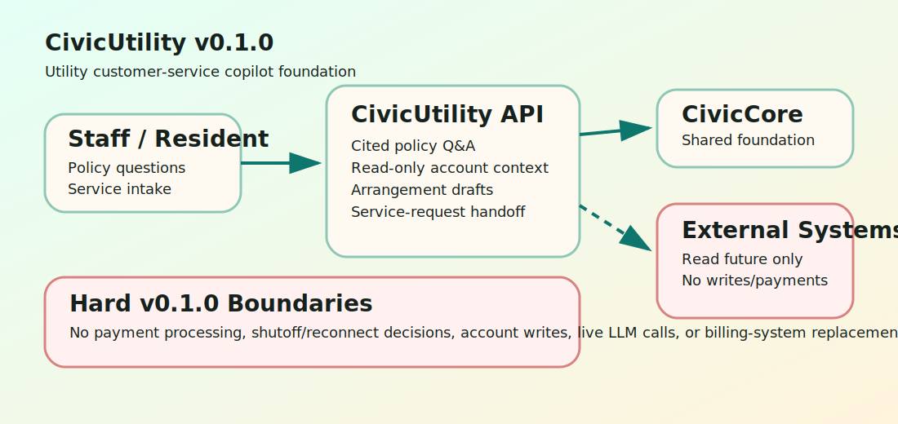

# CivicUtility Architecture

CivicUtility v0.1.0 is a thin, deterministic FastAPI module over CivicCore. It provides a safe customer-service copilot foundation without becoming a utility billing system.

## Shipped

- Utility policy answer drafts with citations.
- CSR-safe read-only account context.
- Payment-arrangement draft language for staff review.
- Service-request intake payloads ready for Civic311/public works handoff.
- Public sample UI and release gates.

## Not Shipped

- Payment processing.
- Billing-system writes.
- Rate engine behavior.
- Shutoff or reconnect decisions.
- Live billing connectors.
- Live LLM calls.
- Civic311 write-back.
